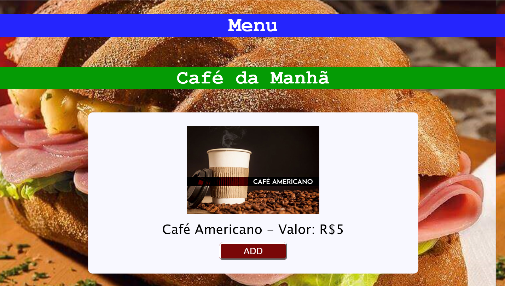

# Burger Queen

## Objetivo
O objetivo principal desse projeto é aprender a construir uma interface web usando React. Esse framework front-end ataca o seguinte problema: **como manter a interface e estado sincronizados**. Portanto, esta experiência espera familiarizar com o conceito de estado da tela e como cada mudança no estado vai refletir na interface (por exemplo, toda vez que adicionamos um _produto_ para um _pedido_, a interface deve atualizar a lista de pedidos e o total). A interface deve ser projetada especificamente para rodar em **tablets**. 

## Resumo do projeto

Um pequeno restaurante de hambúrgueres que está crescendo, necessita de uma
interface em que se possa realizar pedidos utilizando um _tablet_, e enviá-los
para a cozinha para que sejam preparados de forma ordenada e eficiente.

Você pode testar o app clicando [aqui](https://burger-queen-tati.firebaseapp.com)

## E-mail pré cadastrado para teste
Usuário de Salão: salao@salao.com  
Senha: 123456

Usuário de Cozinha: cozinha@cozinha.com  
Senha: 123456

## Histórias de Usuário
#### [História de usuário 1] Usuário deve ter seu perfil (login/senha) para acessar o sistema.

Eu como funcionário do restaurante quero entrar na plataforma e ver apenas a
tela imporante para o meu trabalho.

O que deve acontecer para satisfazer as necessidades do usuário?

* Criar login e senha.
* Criar tipo de usuário (cozinha / salão).
* Entrar na tela correta para cada usuário.

#### [História de usuário 2] Garçom/Garçonete deve ser capaz de anotar o pedido do cliente

Eu como garçom/garçonete quero poder anotar o pedido de um cliente para não
depender da minha memória, saber quanto cobrar e poder enviar os pedidos para a
cozinha para serem preparados em ordem.

O que deve acontecer para satisfazer as necessidades do usuário?

* Anotar o nome do cliente.
* Adicionar o nome do garçom/garçonete ao pedido
* Adicionar produtos aos pedidos.
* Excluir produtos.
* Ver resumo e o total da compra.
* Enviar o pedido para a cozinha (guardar em algum banco de dados).
* Funcionar bem e se adequar a um _tablet_.

